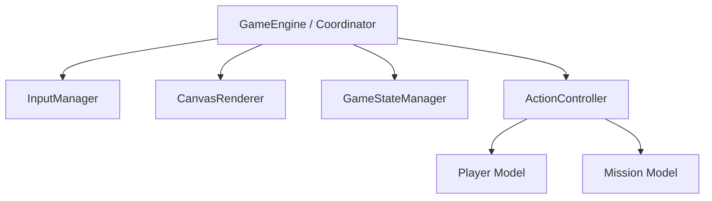

# Refactoring and Testing Plan: `engine.ts`

`CavernGame` currently functions as a "God Class" that mixes UI rendering, input handling, state management, and core game logic. This makes it difficult to maintain, extend, and unit test.

---

## 1. Analysis of Current Responsibilities in `engine.ts`

| Responsibility | Current Code Section | Coupling/Issues |
| :--- | :--- | :--- |
| **Asset Loading** | `loadMonsterList()`, `loadItemList()`, `document.fonts.load` | Relies on global `fetch` and browser font loading. |
| **Canvas & Font Rendering** | `writeAt()`, `clearScreen()`, `render()` | Direct dependency on `HTMLCanvasElement`, `CanvasRenderingContext2D`, and browser APIs. |
| **Input & Control Flow** | `setupInput()`, `handlePlayingKeys()`, `directionalQuestion()` | Tightly bound to keydown events and async prompt hooks. |
| **Game State Machine** | `currentMode: GameMode`, `titlePage()`, `gameLoop()` | Mixed with canvas clearing and requestAnimationFrame loops. |
| **Core Game Actions** | `movePlayer()`, `doSword()`, `doBow()`, `doOpenChest()` | High coupling; modifies state (player/mission) and instantly prints messages/redraws. |

---

## 2. Target Architecture (Separated Concerns)

To break up `engine.ts`, we can divide it into smaller, single-responsibility modules:

### Proposed Modules

1. **`CanvasRenderer` (UI Layer)**
   * **Purpose**: Only handles drawing borders, text grid cells, and fonts onto the canvas context.
   * **No game logic**: It accepts a screen buffer or a subset of state and renders it.
2. **`InputManager` (Input Layer)**
   * **Purpose**: Registers DOM event listeners, manages keystrokes, and calls high-level actions on the Coordinator.
3. **`GameStateManager` (State Layer)**
   * **Purpose**: Manages current mode transitions (`TITLE` ➔ `PLAYING` ➔ `GAME_OVER`) and state variables like player name entry.
4. **`ActionController` (Logic Layer)**
   * **Purpose**: Pure game logic (e.g. movement, combat resolution, looting).
   * **Testability**: **High**. This module has no canvas or DOM dependencies. It only alters the `Player` and `Mission` objects and returns a result description (which the coordinator can choose to display).

---

## 3. Pre-Refactoring Unit Test Strategy

Before refactoring, we need a safety net of tests to prevent regressions. Since `CavernGame` is currently coupled to the browser window/canvas, we have two options:

### Option A: Mock the DOM (Recommended for pre-refactor)
We can mock the canvas, canvas context, and `document` APIs in Vitest. This allows us to instantiate `CavernGame` in a Node environment and run unit tests directly on its methods.

### Option B: Extract Action Helpers
Extract the core calculations into standalone, pure functions or methods that can be tested in isolation without instantiating the full rendering engine.

---

## 4. Proposed Unit Tests to Add

We should add `src/engine.test.ts` with the following test suites:

### Suite 1: Keyboard Input Routing
* **Test**: Pressing `'s'` when state is `PLAYING` triggers `doSword()`.
* **Test**: Pressing `'b'` when state is `PLAYING` triggers `doBow()`.
* **Test**: Pressing `'o'` when state is `PLAYING` triggers `doOpenChest()`.

### Suite 2: Action Resolution (`doBow()`, `doSword()`, `doOpenChest()`)
* **Test**: Firing the bow with 0 arrows prints a warning and doesn't fire.
* **Test**: Firing the bow with arrows decrements the arrow count by 1.
* **Test**: An arrow hit on a monster reduces its points.
* **Test**: An arrow hit on a tree prints a tree obstruction message.
* **Test**: An arrow flying off the grid prints a "flew off" message.
* **Test**: Opening a chest adjacent to the player adds the chest's gold to the player's gold.
* **Test**: Opening a chest replaces the chest sector with a free sector.
* **Test**: Attempting to open a chest when none is adjacent prints a "no chest nearby" warning.

---

> [!NOTE]
> By implementing the mock-based unit tests *before* refactoring, we can proceed with separating the canvas renderer and input controller without breaking the game's behavior.
