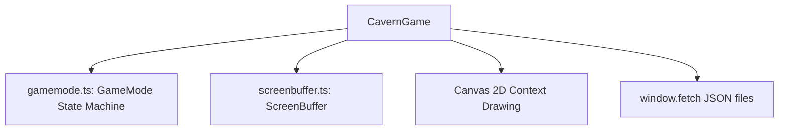

# Refactoring and Testing Plan: `engine.ts` (Revised)

We have successfully implemented the pre-refactoring test safety net (`src/engine.test.ts` with 48 passing tests) and extracted the game states into `src/gamemode.ts`. In addition, we extracted map/sector logic into polymorphic methods on `BaseSector` subclasses.

This revised plan outlines the remaining steps to decouple the core game loop, logical coordinate drawing, and asset loading from browser-specific DOM APIs.

---

## 1. Current State vs. Target Architecture

The responsibilities of `CavernGame` have already been significantly reduced, but it still couples **logical screen buffer updates** with **direct HTML Canvas drawing** and **HTTP asset fetching**.



### Remaining Couplings to Refactor:
1. **HTML5 Canvas Dependency**: `CavernGame` initializes `HTMLCanvasElement`, retrieves `CanvasRenderingContext2D`, sets dimensions, and loops using `requestAnimationFrame`.
2. **Asset Loading Dependency**: `CavernGame` makes direct `fetch()` calls to load `monsters.json` and `items.json`.
3. **Font Loading Dependency**: The entry point waits for `document.fonts.load` before bootstrapping the engine.

---

## 2. Refactoring Milestones

### Milestone 1: Extract `CanvasRenderer`
Extract all HTML Canvas rendering code from `engine.ts` into a standalone `CanvasRenderer` class.

* **Responsibility**: Takes a `ScreenBuffer`, maps characters to IBM PC BIOS glyphs, and draws them to the physical HTML5 Canvas context.
* **Benefit**: `CavernGame` becomes a pure logic engine. It writes characters to a logical 80x25 `ScreenBuffer` and has **zero** knowledge of pixels, fonts, or the HTML DOM.
* **Design**:
  ```typescript
  export class CanvasRenderer {
      private ctx: CanvasRenderingContext2D;
      private charWidth: number;
      private charHeight: number;

      constructor(canvasId: string, charWidth = 8, charHeight = 8) { ... }
      public render(screenBuffer: ScreenBuffer): void { ... }
  }
  ```

### Milestone 2: Extract `AssetRepository` / `DataLoader`
Extract the async loader logic out of `CavernGame` to make it easily stubbable/injectable.

* **Responsibility**: Fetches monsters and items from JSON assets and builds the concrete item and monster templates.
* **Benefit**: Allows us to pass mock monster and item lists directly to `CavernGame` constructors in unit tests without relying on global network fetch mocks.
* **Design**:
  ```typescript
  export class AssetRepository {
      public async loadAll(): Promise<{ monsterList: Monster[], itemList: Item[] }> {
          const monsters = await (await fetch('./monsters.json')).json();
          const items = await (await fetch('./items.json')).json();
          return {
              monsterList: monsters.monsterList,
              itemList: buildItemListFromJSON(items.itemList)
          };
      }
  }
  ```

### Milestone 3: Simplify Engine Instantiation in Entry Point
Clean up the entry point in `engine.ts` by using the new classes:

```typescript
window.addEventListener('DOMContentLoaded', () => {
    document.fonts.load('8px "Web437_IBM_BIOS.woff"').then(async () => {
        const repo = new AssetRepository();
        const { monsterList, itemList } = await repo.loadAll();
        
        const game = new CavernGame({ monsterList, itemList });
        const renderer = new CanvasRenderer('gameCanvas');
        
        function loop() {
            renderer.render(game.getScreenBuffer());
            requestAnimationFrame(loop);
        }
        requestAnimationFrame(loop);
    });
});
```

---

## 3. Impact on Existing Unit Tests

Once these refactors are complete, the unit tests in [engine.test.ts](file:///Users/walker/Dropbox/cavern-and-glen/src/engine.test.ts) can be simplified:
* **No DOM Canvas Mocking**: Tests will no longer need to mock `HTMLCanvasElement`, `getContext`, `width`, or `height`. They can instantiate `new CavernGame(...)` with injected test lists and directly assert the contents of the `ScreenBuffer` via `game.getScreenRow(...)`.
* **No global fetch stubbing**: We can simply pass mock lists to the `CavernGame` constructor instead of overriding `global.fetch`.
